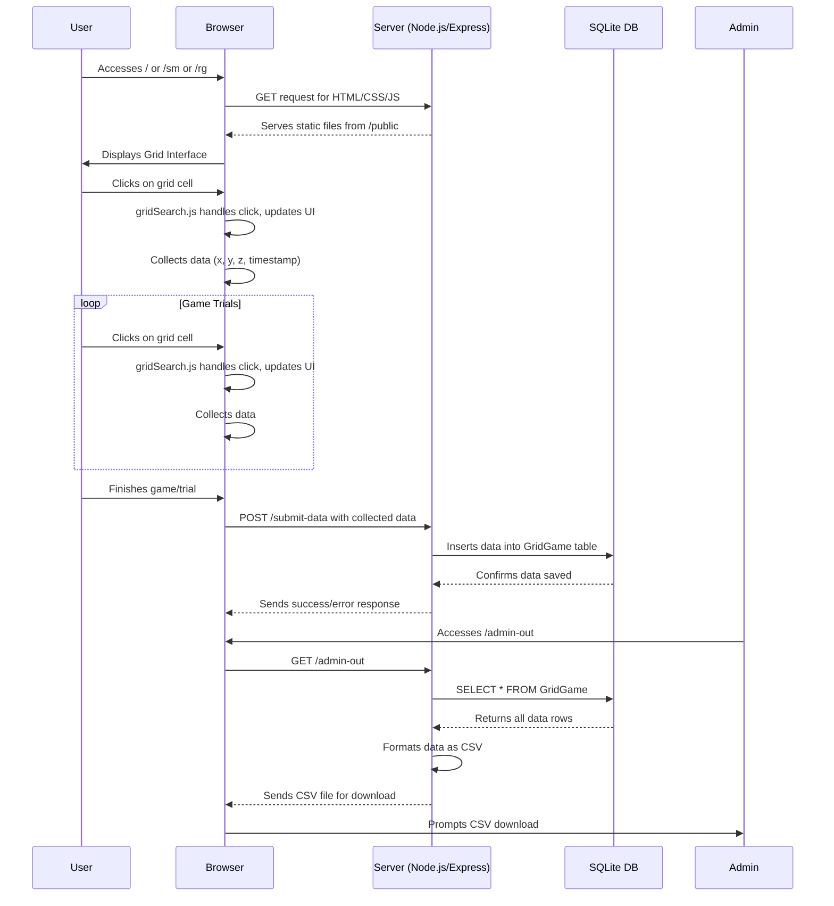

# Kids with Grids

> Repository for "Searching for rewards like a child means less generalization and more directed exploration"  
> Originally adopted from Schulz, Wu, Ruggeri and Meder (Psychological Science, 2019)  
> Code migration by Vasanth (NTU Center for Lifelong Learning and Individualized Cognition (CLIC), 2024)

## Brief Overview
This document provides essential information on deployment and basic working principles of the Node.js-based GridSearch game application.
Detailed hosting steps here: https://youtu.be/DfvaqkA_EOA

---

## Description
**Kids with Grids** is a Node.js application that transforms the traditional GridSearch game, originally designed for Cordova, into a web-based interactive experience. This game offers a unique blend of tasks and challenges centered around grid-based exploration and decision-making, making it an intriguing tool for both educational and research purposes. Developed using Express.js, this application seamlessly integrates with a SQLite database, ensuring efficient data management and persistence within the container's lifecycle.

---

## Features
- Web-based interface for playing the GridSearch game.
- Server-side logic written in Node.js using Express.js.
- Database integration using `sqlite3` for storing game data.
- Responsive web design for various devices and screen sizes using Bootstrap (although it could be more responsive).

## Installation
### Prerequisites
- Node.js (latest stable version recommended)
- Docker (for containerized deployment)

### Steps to Install
1. Clone the repository: `git clone https://github.com/vasanthsreeram/kwg`
2. Navigate to the project directory: `cd kwg`
3. Install dependencies: `npm install`

## Running the Application Locally
1. Start the server: `npm start`
2. Access the application at `http://localhost:3000`.

## Running with Docker
1. Build the Docker image: `docker build -t kids-with-grids .`
2. Run the Docker container: `docker run -p 3000:3000 kids-with-grids`
3. Access the application at `http://localhost:3000`.

## Application Structure
- `server.js`: The main server file that sets up the Express application, routes, and database connection.
- `public/`: Contains static files like HTML, CSS, and JavaScript for the client-side.
- `Dockerfile`: Defines the Docker container for the application.
- `docker-compose.yml`: Configuration for running the application using Docker Compose.
- `public/index.html`: The main HTML file for the game interface.

### Workflow Visualization



## JavaScript Files in /public/js
- `gridSearch.js`: Manages the game logic, including grid generation, score tracking, and user interactions within the GridSearch game.
- `isrc-utils.js`: Contains utility functions and handlers, facilitating operations like data saving, routing between different parts of the application, and preloading images for a smoother user experience.
- `stimuli.js`: Responsible for managing and presenting different stimuli in the game, handling user responses, and navigating through the different stages of the game.

## API Endpoints
- `GET /sm`: Serves the game interface with smooth condition.
- `GET /rg`: Serves the game interface with rough condition.
- `GET /`: Serves the game interface with a random condition.
- `POST /submit-data`: Endpoint to submit game data to the database.
- `GET /admin-out`: Endpoint to download all collected data as a CSV file.

## Condition Modification
Modification of condition can be done by changing the `kernelRough.json` and `kernelSmooth.json` files in the `public/` directory.

## Database Configuration
The application uses a **SQLite** database, managed by the `sqlite3` package in Node.js.
- The database file is created at `/tmp/database.sqlite` within the Docker container by default (see `server.js`).
- The necessary table (`GridGame`) is created automatically if it doesn't exist when the server starts.

The SQL command used to create the table is:
```sql
CREATE TABLE IF NOT EXISTS GridGame (
  id INTEGER PRIMARY KEY AUTOINCREMENT,
  UID INTEGER,
  Duration REAL,
  Date TEXT,
  Condition INTEGER,
  Scale TEXT,
  EnvOrder TEXT,
  tscollect TEXT,
  xcollect TEXT,
  ycollect TEXT,
  zcollect TEXT,
  zcollectScaled TEXT,
  BonusLevel TEXT,
  StarArray TEXT,
  TesterNotes TEXT
);
```

**Important Note on Data Persistence:** When running the application inside a Docker container using the default configuration, the SQLite database file is stored in the `/tmp` directory, which is **ephemeral**. This means **all data will be lost** when the container stops or restarts. For persistent data storage in production deployments (like on Azure), you must configure a volume mount to store the database file outside the container (e.g., using Azure Files or another persistent storage solution).

## Deployment
### Deploying with Docker on Azure
You can deploy this application as a Docker container to various Azure services like Azure App Service for Containers or Azure Container Instances (ACI).

1.  **Build the Docker Image:**
    ```bash
    docker build -t youracr.azurecr.io/kids-with-grids:latest . 
    ```
    (Replace `youracr.azurecr.io` with your Azure Container Registry name)

2.  **Push to Azure Container Registry (ACR):**
    ```bash
    az login 
    az acr login --name youracr 
    docker push youracr.azurecr.io/kids-with-grids:latest
    ```

3.  **Deploy to Azure:**
    *   **Using Azure App Service for Containers:** Create a new Web App for Containers and configure it to use the image pushed to your ACR. **Crucially, configure path mappings or persistent storage (like Azure Files) to mount a volume at `/tmp` inside the container** to ensure the `database.sqlite` file persists across restarts.
    *   **Using Azure Container Instances (ACI):** Create a new ACI instance using the image from your ACR. You will need to **configure an Azure File Share volume mount at `/tmp`** during creation for data persistence.

4.  **Access:** Access the deployed application via the URL provided by Azure App Service or ACI.

### Deploying to other Cloud Platforms (e.g., Heroku, AWS)
1. Set up an account on your chosen cloud platform.
2. Deploy the Node.js application following the platform's guidelines (Docker deployment is often supported).
3. **Ensure you configure persistent storage** if required, mapping it to the `/tmp` directory or modifying `server.js` to use a different database path/service.
4. Access the deployed application through the provided URL.

## Exporting Data
To download all collected game data:
1. Navigate to the `/admin-out` endpoint of your running application (e.g., `http://localhost:3000/admin-out` or `http://<your-azure-app-url>/admin-out`).
2. This will trigger a download of a CSV file named `gridgame_data.csv` containing all records from the `GridGame` table.

## Contributing
Contributions to this project are welcome. Please submit pull requests for any enhancements, bug fixes, or documentation improvements.
